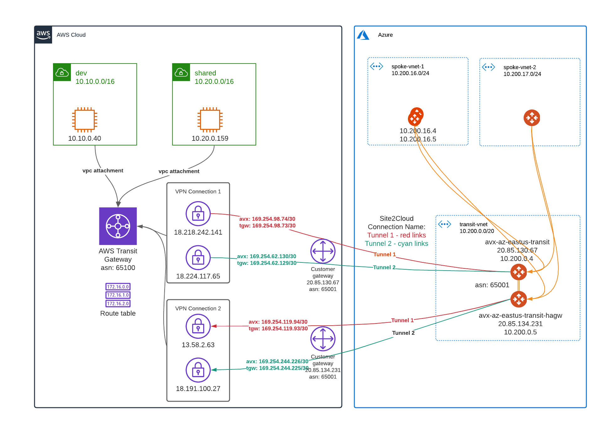

# terraform-aws-tgw-ipsec-bgp-to-avx-transit
This module creates IPSec/BGP connections between AWS TGW and Aviatrix Transit GW

From AWS TGW side, two VPN connections will be created, shown as 
- VPN Connection 1 ({ConnectionName}-Primary)
- VPN Connection 2 ({ConnectionName}-Ha)

Each VPN Connection have two tunnels, shown as:
- VPN Connection 1
  - Tunnel-1 Tunnel to Avx Primary GW
  - Tunnel-2 Tunnel to Avx Primary GW
- VPN Connection 2
  - Tunnel-1 Tunnel to Avx HA GW
  - Tunnel-2 Tunnel to Avx HA GW

On Aviatrix side, two connections will be created:
  - {ConnectionName}-Tunnel1
  - {ConnectionName}-Tunnel2

Each connection will connect to TGW as this methods

  - {ConnectionName}-Tunnel1
    - Towards tunnel1 endpoint in {ConnectionName}-Primary 
    -  Towards tunnel1 endpoint in {ConnectionName}-Ha 
  - {ConnectionName}-Tunnel2
    - Towards tunnel2 endpoint in {ConnectionName}-Primary 
    - Towards tunnel2 endpoint in {ConnectionName}-Ha 